<div align="center">

# 🦜🔗 LangChain & Generative AI Master Guide

<p align="center">
  <strong>From Core LLM Foundations to Advanced RAG Pipelines & Autonomous Agents</strong>
</p>

[](https://www.python.org/)
[](https://www.langchain.com/)
[](https://platform.openai.com/)
[](https://huggingface.com/)
[](LICENSE)

<br/>

> **LangChain** is an enterprise-grade orchestration framework designed to bridge raw Large Language Models (LLMs) with external data sources, computational tools, conversation state, and decision-making logic.

</div>

---

## 🧭 Repository Explorer & Roadmap

This repository is organized into modular, self-contained chapters. You can explore each topic directly in the codebase:

| Directory | Module Focus | Core Concepts Covered |
| :--- | :--- | :--- |
| [`1_Models/`](./1_Models) | **Model Integrations** | Closed-source APIs (OpenAI, Anthropic), Open-source local models (Hugging Face, Ollama), Embedding vectors |
| [`2_Prompts/`](./2_Prompts) | **Prompt Engineering** | `PromptTemplate`, `ChatPromptTemplate`, `MessagesPlaceholder`, Dynamic Few-Shot prompting |
| [`3_Structured_Output/`](./3_Structured_Output) | **Schema Enforcement** | Pydantic validation, TypedDict outputs, JSON mode, function calling schemas |
| [`4_Output_Parsers/`](./4_Output_Parsers) | **Response Parsing** | `StrOutputParser`, `JsonOutputParser`, `CommaSeparatedListOutputParser` |
| [`5_Chains/`](./5_Chains) | **Orchestration** | LCEL syntax (`prompt \| model \| parser`), sequential workflows, routing logic |
| [`6_Runnables/`](./6_Runnables) | **Primitives & Concurrency** | `RunnableSequence`, `RunnableParallel`, `RunnablePassthrough`, `RunnableLambda` |

---

## 📑 Table of Contents

- [1. Paradigm Shift: Raw LLM vs. LangChain](#-1-paradigm-shift-raw-llm-vs-langchain)
- [2. Why Do We Need LangChain? (The RAG Case Study)](#-2-why-do-we-need-langchain-the-rag-case-study)
- [3. The 6 Pillars of LangChain](#-3-the-6-pillars-of-langchain)
  - [I. Models (The Intelligence Core)](#i-models-the-intelligence-core)
  - [II. Prompts (The Instructions)](#ii-prompts-the-instructions)
  - [III. Chains (The Orchestration Engine)](#iii-chains-the-orchestration-engine)
  - [IV. Memory (Stateful Conversations)](#iv-memory-stateful-conversations)
  - [V. Indexes & RAG (External Grounding)](#v-indexes--rag-external-grounding)
  - [VI. Agents (Autonomous Decision Makers)](#vi-agents-autonomous-decision-makers)
- [4. Chains vs. Agents Architecture](#-4-chains-vs-agents-architecture)
- [5. Complete System Architecture (Zoom In / Zoom Out)](#-5-complete-system-architecture)
- [6. Real-World Case Study: AI Study Assistant](#-6-real-world-case-study-ai-study-assistant)
- [7. Production RAG Architecture](#-7-production-rag-architecture)
- [8. Generative AI Learning Roadmap](#-8-generative-ai-learning-roadmap)

---

# ⚡ 1. Paradigm Shift: Raw LLM vs. LangChain

A vanilla LLM interaction is isolated, stateless, and single-turn:

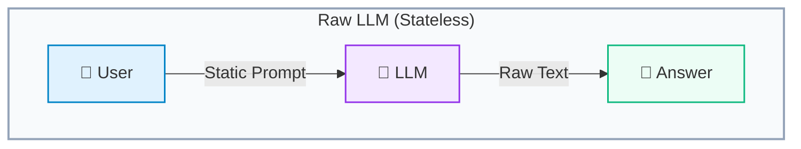

Real-world enterprise systems demand grounding against company databases, remembering multi-turn context, validating output schemas, and invoking external APIs dynamically.

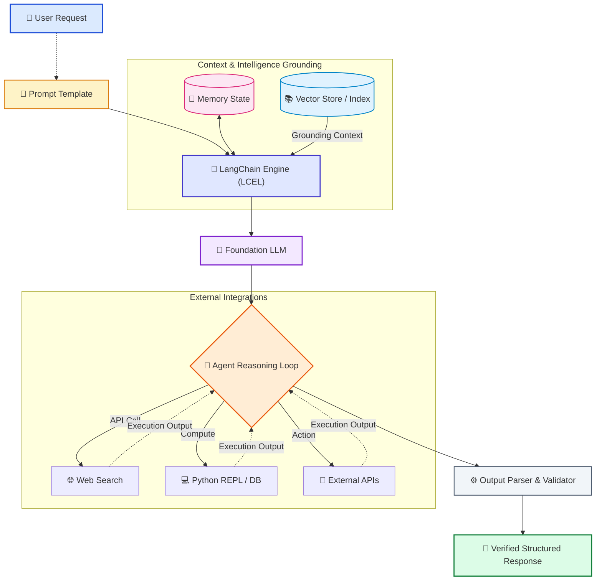

---

# 🚀 2. Why Do We Need LangChain? (The RAG Case Study)

Suppose you are building a **Document Q&A Assistant** (e.g., asking questions over technical manuals or financial PDFs). 

### Without a Framework
Developers had to write hundreds of lines of boilerplate glue code: PDF text extraction, recursive sliding window chunking, computing embeddings, indexing in FAISS or Chroma, creating similarity search queries, assembling prompt strings, handling rate limits, and parsing responses.

### With LangChain
LangChain abstracts this pipeline into modular, pluggable primitives:

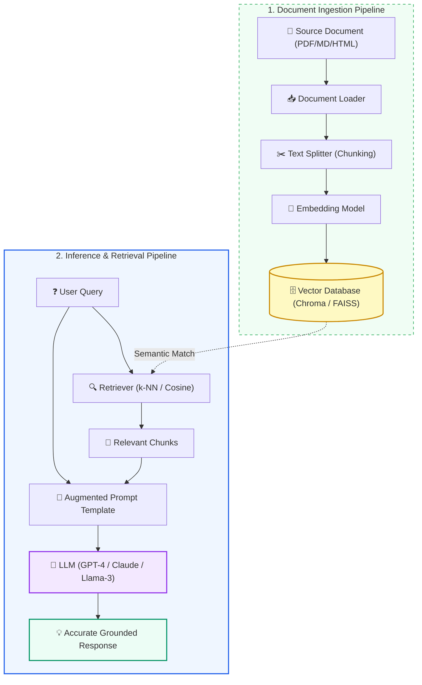

> [!TIP]
> **Core Value Proposition**: LangChain standardizes the interfaces between models, prompt engines, memory stores, and vector databases so you can swap out any component with a single line of code.

---

# 🧩 3. The 6 Pillars of LangChain

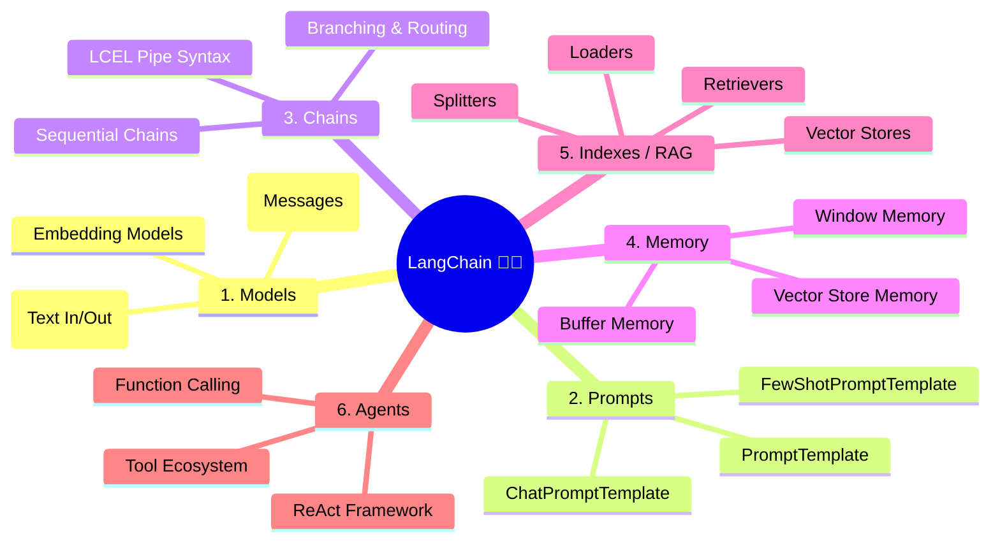

---

## I. Models (The Intelligence Core)

Models form the cognitive backbone of LangChain applications. LangChain unifies model providers behind two standard interfaces:

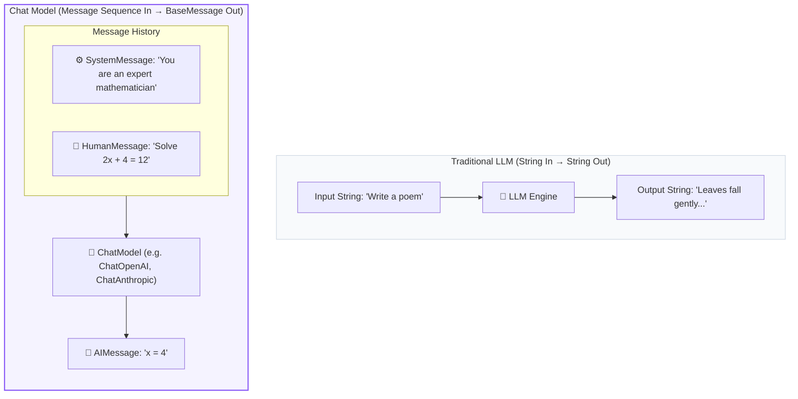

```python
from langchain_openai import ChatOpenAI
from langchain_core.messages import SystemMessage, HumanMessage

# Standardized interface across OpenAI, Anthropic, Ollama, etc.
model = ChatOpenAI(model="gpt-4o", temperature=0.2)

messages = [
    SystemMessage(content="You are a helpful coding tutor."),
    HumanMessage(content="What is a closure in Python?")
]
response = model.invoke(messages)
print(response.content)
```

---

## II. Prompts (The Instructions)

Instead of manual string concatenation, LangChain provides **parameterized templates** that validate input variables, format few-shot examples, and construct role-based chat histories.

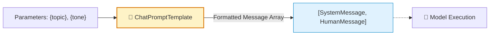

```python
from langchain_core.prompts import ChatPromptTemplate

prompt_template = ChatPromptTemplate.from_messages([
    ("system", "You are an AI specialized in {domain}. Answer concisely in {language}."),
    ("human", "Explain the concept of {concept}.")
])

# Generate formatted messages
formatted_prompt = prompt_template.invoke({
    "domain": "Machine Learning",
    "language": "English",
    "concept": "Gradient Descent"
})
```

---

## III. Chains (The Orchestration Engine)

Chains connect multiple components sequentially or concurrently. Modern LangChain uses **LCEL (LangChain Expression Language)** via the Unix pipe (`|`) operator.

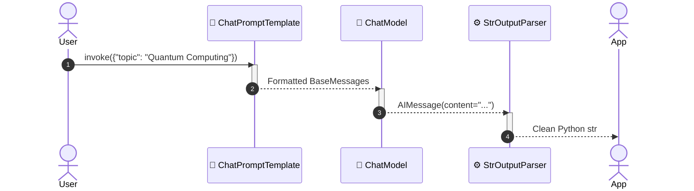

```python
from langchain_openai import ChatOpenAI
from langchain_core.prompts import ChatPromptTemplate
from langchain_core.output_parsers import StrOutputParser

# Building a production-ready LCEL Chain with the pipe operator
prompt = ChatPromptTemplate.from_template("Summarize {article} in 3 bullet points.")
model = ChatOpenAI(model="gpt-4o-mini")
parser = StrOutputParser()

# Pipe syntax: input -> prompt -> model -> parser
chain = prompt | model | parser

result = chain.invoke({"article": "LangChain 0.2 was released with improved modularity..."})
print(result)
```

---

## IV. Memory (Stateful Conversations)

LLMs are inherently stateless. To maintain coherent conversations, LangChain persists past interactions and injects relevant history into the prompt payload before model invocation.

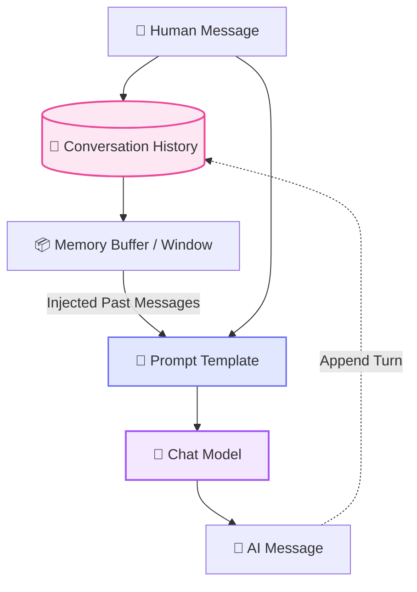

> [!NOTE]
> **Key Realization**: The model itself does not store your chat history. LangChain handles storing turns in memory (e.g., Redis, SQLite, or in-memory buffers) and passes the chat history alongside the new query.

---

## V. Indexes & RAG (External Grounding)

Indexes transform unstructured corporate or domain knowledge into semantic embeddings so an LLM can reference facts outside its training cutoff.

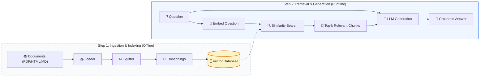

---

## VI. Agents (Autonomous Decision Makers)

While **Chains** follow a predetermined hardcoded sequence, **Agents** use the LLM as a reasoning engine to inspect inputs, decide which tools to execute, evaluate intermediate observations, and loop until a completion condition is met.

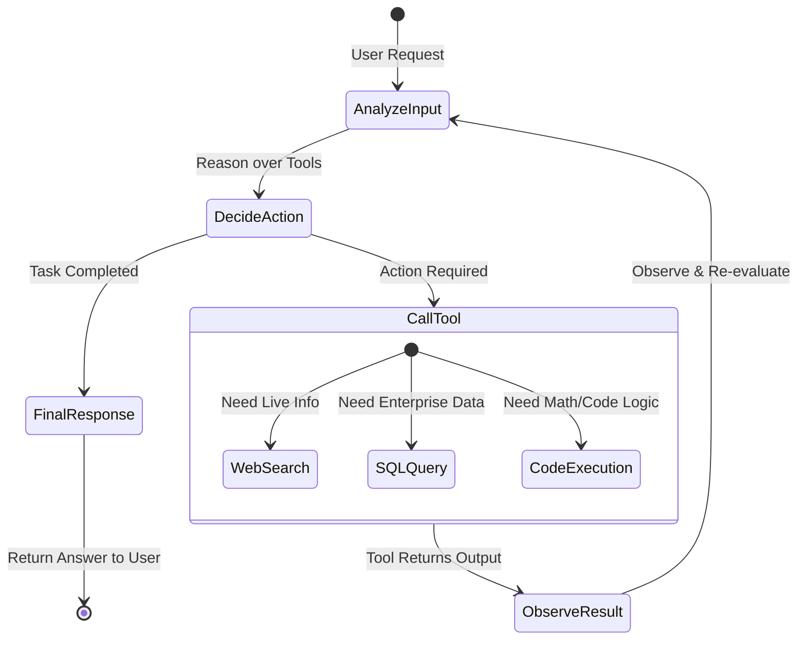

---

# ⚖️ 4. Chains vs. Agents Architecture

Understanding when to deploy a deterministic chain versus an autonomous agent is critical for performance, latency, and cost control:

| Dimension | 🔗 Chains | 🤖 Agents |
| :--- | :--- | :--- |
| **Execution Flow** | Fixed, predetermined directed acyclic graph | Dynamic reasoning loop (ReAct / Plan-and-Solve) |
| **Decision Logic** | Developer defines every step beforehand | Model determines which tool to execute at runtime |
| **Predictability** | High (identical pipeline every run) | Variable (depends on model reasoning capabilities) |
| **Latency & Cost** | Low & predictable token usage | Variable (multiple model iterations per request) |
| **Best Used For** | ETL pipelines, standard RAG, summarization | Complex research, multi-API workflows, automated tasks |

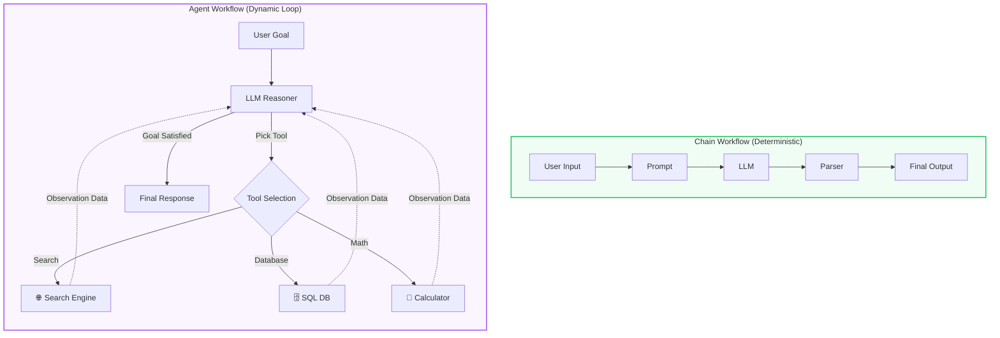

---

# 🏗️ 5. Complete System Architecture

Here is how all 6 core components interact inside a production-grade LangChain application:

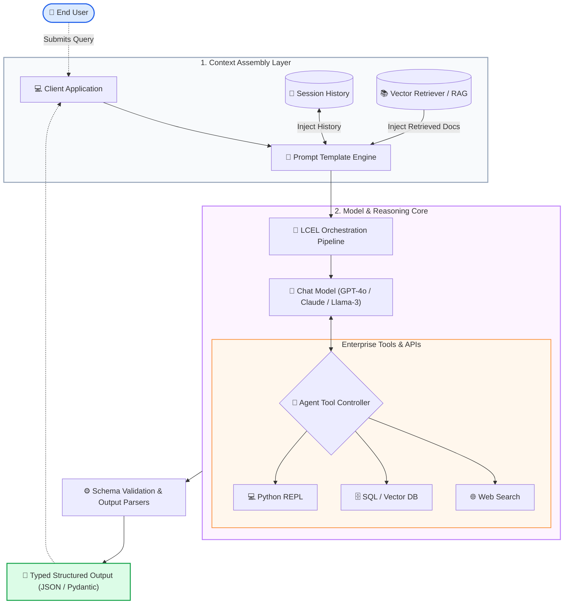

<details>
<summary>🔍 <b>Zoom In: Deep-Dive Component Lifecycle (Click to Expand)</b></summary>

<br/>

The diagram below provides an expanded, step-by-step lifecycle showing memory state reads/writes, vector similarity scoring, tool execution cycles, and pydantic schema assertions:

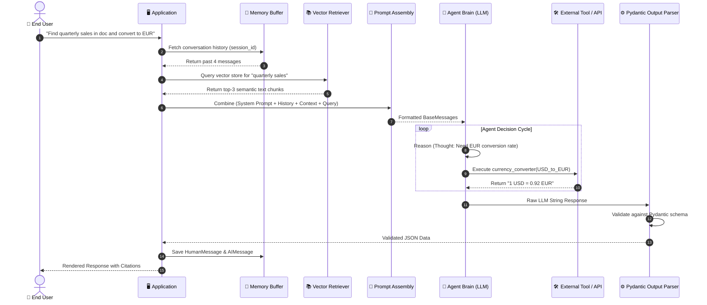

</details>

---

# 🚀 6. Real-World Case Study: AI Study Assistant

Consider building an intelligent **AI Academic Study Assistant**:

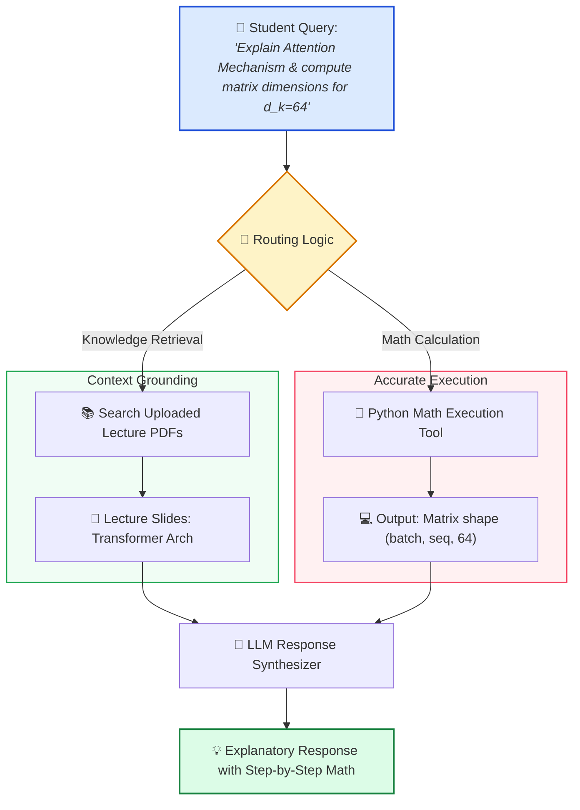

---

# 🔥 7. Production RAG Architecture

A production-grade Retrieval-Augmented Generation pipeline involves distinct ingestion and inference phases:

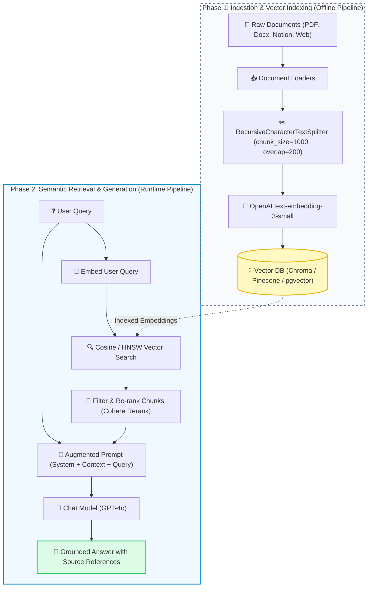

---

# 🛣️ 8. Generative AI Learning Roadmap

To master LangChain and modern GenAI engineering, follow this recommended progression path:

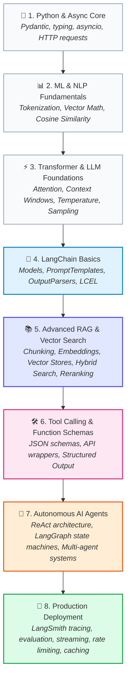

---

# 🧠 Core Mental Model Summary

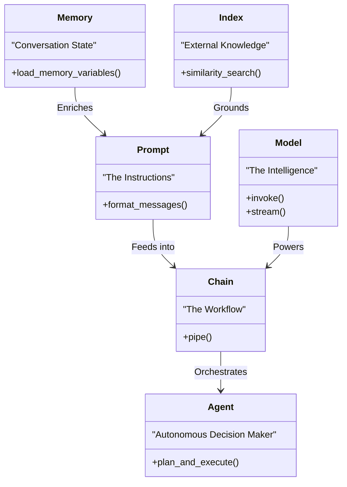

---

<div align="center">

### 💡 Hands-On Practice

Begin your journey with the code examples in this repository:

[**Explore Chapter 1: Models ➔**](./1_Models) • [**Explore Chapter 2: Prompts ➔**](./2_Prompts) • [**Explore Chapter 5: Chains ➔**](./5_Chains)

</div>
